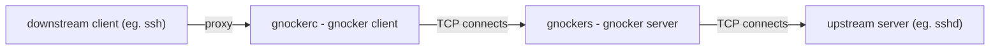

# gnocker

**gnocker** is a port knocking implementation that enables SSH key-based,
latency-efficient access control without requiring pre-opened ports. By reusing
reusing the single TCP stream for both authentication and the upstream
application transport, gnocker avoids extra round-trip latency.

**WARNING**: **gnocker** hasn't been through a third-party security evaluation by
a human. Please use it at your own risks!

1. [Goals](#goals)
2. [High level communication protocol](#high-level-communication-protocol)
3. [Quick start](#quick-start)
    - [Download `gnockerc` and `gnockers`](#download-gnockerc-and-gnockers)
    - [Prepare an authorized key file](#prepare-an-authorized-key-file)
    - [Start the `gnockers` server](#start-the-gnockers-server)
    - [Connect using `gnockerc`](#connect-using-gnockerc)
4. [Protect an SSH server using systemd](#protect-an-ssh-server-using-systemd)
    - [Server configuration](#server-configuration)
    - [Client configuration](#client-configuration)
5. [Graceful shutdown](#graceful-shutdown)
6. [Build from source](#build-from-source)
7. [Why gnocker?](#why-gnocker)
8. [Attack model](#attack-model)
9. [Protocol](#protocol)
10. [Why Golang?](#why-golang)


# Goals

Goals:

* no extra round-trips at the protocol level not to add extra latency
* security through strong cryptography: re-use the SSH public key infrastructure
* reduce the supply chain attack risk to its minimum (see [Why Golang?](#why-golang))
* prevent "knocking packets" from being replayed

Non goals (see [Attack model](#attack-model) below):

* Protect against MITM: an attacker in an MITM position can get a TCP stream successfully "gnocker" for them
* Protect the upstream stream against eavesdropping or tampering: this is needs to be supported by the upstream application protocol

# High level communication protocol

**gnocker** works by listening to TCP connections, verifying the [knock packet
from the client](#protocol), and then forward the rest of the connection to
the upstream server:



For now, `gnockerc` reads and writes the original application data through
(respectively) stdin/stdout. This makes it a great candidate for the OpenSSH
client through the use of the [`ProxyCommand` configuration
directive](https://man.archlinux.org/man/ssh_config.5.en#ProxyCommand). Further
development could involve eg. `gnockerc` exposing a SOCKS proxy for easier
integrations with other tools.

# Quick start

In this tutorial, we're going to connect to an SSH server through **gnocker**.

## Download `gnockerc` and `gnockers`

First, download the `gnockerc` client and `gnockers` server from the [Releases
page](https://github.com/aguinet/gnocker/releases).

Optionally, verify them with [Github Artifact Attestation](https://docs.github.com/en/actions/how-tos/secure-your-work/use-artifact-attestations/use-artifact-attestations):

```
$ gh attestation verify gnockers-linux-amd64 --repo aguinet/gnocker
$ gh attestation verify gnockerc-linux-amd64 --repo aguinet/gnocker
```

## Prepare an authorized key file

Create a file in the "autorized keys" SSH format to list the SSH public keys
that can "gnock" to your server:

```bash
$ cat ~/.ssh/id_rsa.pub >authorized_keys
$ cat ~/.ssh/id_ecdsa.pub >>authorized_keys
[...]
```

## Start the `gnockers` server

The `gnockers` server listens on a port and forwards authenticated connections
to an upstream service. Here, we assume an upstream SSH server already runs on
`localhost:22`. Run `gnockers` to listen on port 2222 and forward authenticated
connections to `localhost:22`:

```bash
./gnockers \\
    -akf /etc/gnocker/authorized_keys \\
    -listen-host 127.0.0.1 \\
    -listen-port 2222 \\
    -server-host 127.0.0.1 \\
    -server-port 22
```

`gnockers` flags are:

- `-akf <path>`: Path to the `authorized_keys` file containing authorized public keys
- `-listen-host <addr>`: Address to bind
- `-listen-port <port>`: Port to listen on
- `-server-host <host>`: Backend service to forward connections to
- `-server-port <port>`: Backend service port

## Connect using `gnockerc`

Connect to the SSH server using `gnockerc` through `gnockers` listening on port 2222:

```
$ ssh -oProxyCommand="/path/to/gnockerc -h 127.0.0.1 -p 2222 -i ~/.ssh/id_rsa.pub" user@127.0.0.1
```

This assumes that the private key corresponding to `~/.ssh/id_rsa.pub` is
loaded already in your SSH agent. To do so:

```
$ ssh-add ~/.ssh/id_rsa
```

`gnockerc` flags are:
- `-h <host>`: The gnockers server hostname or IP
- `-p <port>`: The port where gnockers is listening
- `-i <path>`: Path to private key file, or a public key loaded in your SSH agent

# Protect an SSH server using systemd

This sections "industrialises" the setup in the [Quick demo](#quick-demo) above by:

* properly setting up `sshd` to listen to `127.0.0.1`
* starting `gnockers` with systemd
* configuring the client's `ssh_config` to use `gnockerc`

## Server configuration

### Configure sshd to listen to localhost (and potentially a different port)

Edit `/etc/ssh/sshd_config`:

```bash
ListenAddress 127.0.0.1
# Potentially listen on port 2222 instead of 22
Port 2222
```

Do not restart sshd yet, we'll do that once `gnockers` is setup.

### Deploy the gnockers systemd service

Copy the `gnockers.service` file in this repository into your systemd configuration:

```bash
# cp /path/to/gnockers.service /etc/systemd/system/gnockers.service
# systemctl daemon-reload
# systemctl enable gnockers
# systemctl start gnockers
```

Verify the service is running:

```bash
sudo systemctl status gnockers
```

View the service configuration:

```bash
systemctl cat gnockers
```

The default service file includes some security hardening:
- `DynamicUser=yes` - Uses a transient systemd user
- `NoNewPrivileges=yes` - Can't acquire new privileges through `execve`
- `ProtectHome=yes` - No access to home directories
- `ProtectSystem=strict` - Makes most of the filesystem read-only
- `SecureBits=keep-caps` - Preserves effective capabilities
- `AmbientCapabilities=CAP_NET_BIND_SERVICE` - Allows binding to ports <1024

### Restart sshd and start gnockers

Restart sshd so that it listens on localhost and then starts gnockers:

```
# systemctl restart sshd
# systemctl start gnockers
```

You're now all set on the server side! Let's move to the SSH client
configuration.

## Client configuration

Edit `~/.ssh/config` and use the
[`ProxyCommand`](https://man.archlinux.org/man/ssh_config.5.en#ProxyCommand)
directive to use `gnockerc` to connect to your [previously "gnockered" SSH
server](#server-configuration):

```bash
Host myserver
    User johndoe
    ProxyCommand /path/to/gnockerc -h myserver.home -p 22 -i ~/.ssh/id_rsa.pub
```

You can now use `ssh myserver` to seamlessly connect to your SSH server with port knocking enabled!

# Graceful shutdown

`gnockers` handles shutdown gracefully so that existing TCP connections aren't
closed when restarting it.

To do so, upon receiving `SIGTERM` or `SIGINT`, `gnockers` will:

* stop listening to its socket
* wait for all existing connections to finish
* then exit

During this phase, if it receives another `SIGTERM` or `SIGINT`, it will not
intercept them and thus exit directly. This also means that multiple `gnockers`
might be running on your server after a restart until the connections they handle
terminate.

# Build from source

**gnocker** needs golang >= 1.22. To build both the client and server from source:

```
# Build the client
$ go build ./cmd/gnockerc

# Build the server
$ go build ./cmd/gnockers
```

# Why gnocker?

During the 2020 decade, OpenSSH suffered from pretty serious pre-auth issues:

* the [XZ backdoor](https://www.openwall.com/lists/oss-security/2024/03/29/4), that managed to made its way to Debian Sid. If not for the perseverance of [Andres Freund](https://mastodon.social/@AndresFreundTec), it could have made its way to Debian stable
* [regreSSHion](https://blog.qualys.com/vulnerabilities-threat-research/2024/07/01/regresshion-remote-unauthenticated-code-execution-vulnerability-in-openssh-server): a race condition with OpenSSH+glibc that can be triggered pre-auth

Moreover, most of the existing port knocking protocols the author is aware of
have a "multi stream" workflow, where one needs to authenticate to one service
to open the port to another one. **gnocker** uses a different approach where the
TCP client stream is just reused to talk to the upstream service, reducing the
extra latency to virtually zero, and doesn't require any interaction with a
firewall to work.


# Attack model

**gnocker** only does one thing: allow an external client to communicate with a
server. **More importantly, it will not protect against eavesdropping and
tampering of the underlying & upstream application traffic**. If these are your
needs, you should use a protocol designed for this, eg. TLS.

This also means that if an attacker is in an MITM position, it can hijack a
successfully "gnocked" TCP stream. Protecting against this would require an
extra round trip with the server, which we decide not to do to not to add extra
latency.

# Protocol

See [PROTOCOL.md](PROTOCOL.md) for a detailed explanation of the protocol.

A few key highlights:

* privacy: no user identifiable identifiers are used in the knock packet
* anti-replay: nonces & timestamps are used to prevent packets from being replayed, while keeping memory usage on the server-side contained
* latency: the protocol just needs extra bytes sent at the beginning of the TCP client stream without any extra round/trips. The Golang implementation tries hard to include as much data as possible in the first "packets" it sends from the downstream client (in the case of SSH, this means the client banner).
* cryptographic signatures: the protocol doesn't rely on obscurity but on strong crypgtography to provide access

# Why Golang?

The Golang standard libraries are very rich. More precisely:

* the [Golang X packages](https://go.dev/wiki/X-Repositories) already bring all
  the necessary bits we need to support and use SSH keys as part of our implementation.
* Golang has native supports for handling hundreds of thousands of concurrent streams within one process.

This means that the dependencies **gnocker** uses are only limited to the Golang
standard library and X packages. This really reduces the number of organization
we need to trust to the one Golang team.
